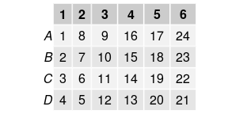
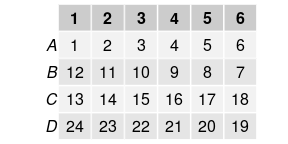
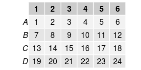
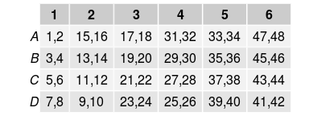
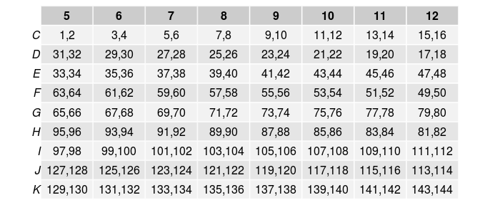

<!-- README.md is generated from README.Rmd. Please edit that file -->
toxplate
========

Creates a plate layout for your experiment based on the top-left and the bottom-right well and a possible zigzag pattern. These layout files can be used to match the location (aka 'imageNr') in the image filename to the correct well in the plate. The resulting plate layout data can be exported and used in 'CellProfiler' instead of putting all images in separate well folders.

Usage
-----

The `toxplate` package provides two functions: `getLayoutPicture` and `getLayoutMappingDF`. `getLayoutPicture` generates a picture of your layout, which you can use to store with your experiment and to inspect your layout before generating a layout mapping with `getLayoutMappingDF`. Both functions take the same arguments: the top-left and bottom-right well, the zigzag direction, and the starting number. For more details about the arguments use `?getLayoutPicture`

### `getLayoutPicture`

Example usage for a typical 24-well plate with 1 location per well, and zigzag over columns:

``` r
getLayoutPicture("A01", "D06", "columns")
```



The same plate, but with zigzag over rows:

``` r
getLayoutPicture("A01", "D06", "rows")
```



and without zigzag (rows):

``` r
getLayoutPicture("A01", "D06", "notZigzagRowWise")
```



To use multiple positions per well just add the maximum position to the bottom-right well:

``` r
getLayoutPicture("A01", "D06_02", "columns")
```



One more example of a partially filled bigger plate

``` r
getLayoutPicture("C05", "K12_02", "rows")
```



When the layout is what you expect you can generate a mapping with `getLayoutMappingDF` (I used `as_tibble` to prevent long output):

``` r
getLayoutMappingDF("A01", "D06_02", "columns") %>% as_tibble
#> # A tibble: 48 × 6
#>      row   col   pos   loc well_name well_name_p
#>    <chr> <dbl> <dbl> <dbl>     <chr>       <chr>
#> 1      A     1     1     1       A01       A01_1
#> 2      B     1     1     3       B01       B01_1
#> 3      C     1     1     5       C01       C01_1
#> 4      D     1     1     7       D01       D01_1
#> 5      A     2     1    15       A02       A02_1
#> 6      B     2     1    13       B02       B02_1
#> 7      C     2     1    11       C02       C02_1
#> 8      D     2     1     9       D02       D02_1
#> 9      A     3     1    17       A03       A03_1
#> 10     B     3     1    19       B03       B03_1
#> # ... with 38 more rows
```
